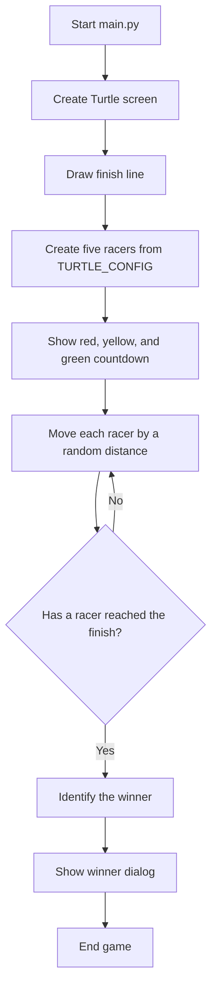

# Turtle Race

A Python turtle race in which any turtle can win. The race includes a finish
line, a traffic-light countdown, random movement, and a winner message.

## Requirements

- Python 3
- Tkinter

`turtle` and `tkinter` are included with most Python installations. On some
Linux distributions, Tkinter may need to be installed separately, for example:

```bash
sudo apt install python3-tk
```

## Run the race

From this directory, run:

```bash
python3 main.py
```

The original command is also supported:

```bash
python3 turtles-1.py
```

## How the game works



## Project structure

- `main.py` - application entry point.
- `race.py` - screen setup, turtle creation, countdown, race logic, and winner dialog.
- `turtles-1.py` - backwards-compatible launcher for `main.py`.
